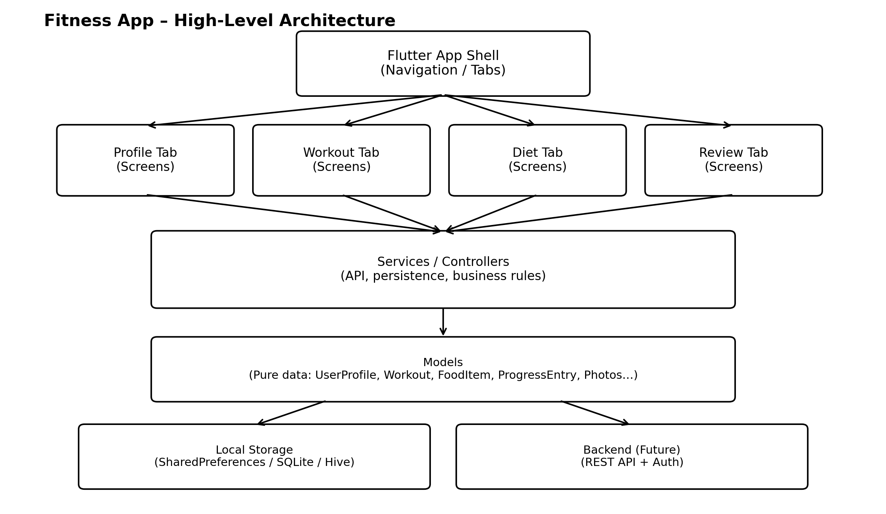

# Application architecture

## High-level diagram

## High-level structure
- Models: pure data representations
- Screens: UI and user interaction
- Services: business logic

## Core principles
- Separation of concerns
- Avoid circular dependencies
- Design for scalability before optimization

## Current state
The architecture is designed to evolve towards:
- REST backend
- Authentication
- Multi-user support
